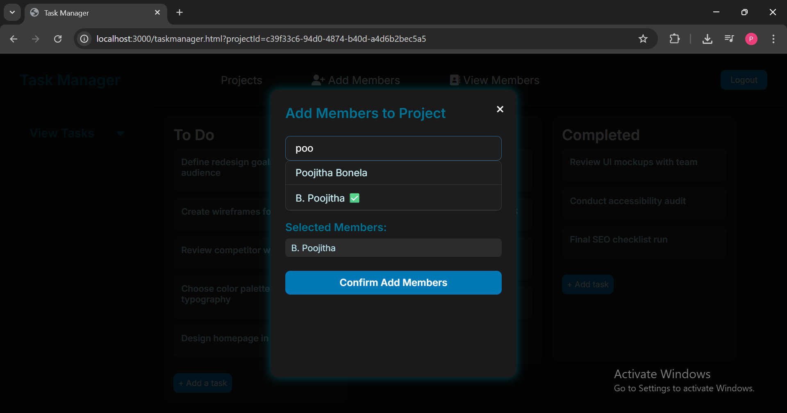

🗂️ Project_Management_Tool

* Project_Management_Tool is a collaborative full-stack project management web application inspired by Trello.
* It enables users to create, manage, and collaborate on projects by organizing tasks into To Do, In Progress, and Completed columns. 
* Users can assign members, set deadlines, upload attachments, and comment on tasks—all within a clean drag-and-drop interface.

-----------------------------------------------------------------------------------------------------------------------------------------------------------------------------

💡 Tech Stack Used-

Frontend:
* HTML, CSS, JavaScript
  Static pages for login, registration, project dashboard (`projectmanager.html`), and task board (`taskmanager.html`)
  Client-side interactivity and drag-and-drop handled in JS
  Located in the `/public` folder

Backend:
* Node.js with Express.js
  Handles API routing, authentication, sessions, and business logic
  All backend logic is modularized in the `/Project-Management-Tool/` directory

Database:
* MySQL with Sequelize (ORM)
  Stores user accounts, projects, tasks, comments, assignments, deadlines
  Database connection configured in `config/db.js`

Authentication:
* Passport.js for middleware authentication
* Google OAuth (`passport-google-oauth20`) for login
* `express-session` for managing login sessions

Environment:
* Environment variables configured in `.env.demo` and loaded via `dotenv`

-----------------------------------------------------------------------------------------------------------------------------------------------------------------------------

📁 Folder & File Overview -

Top-Level Files and Folders:

 * `.env.demo`  
    - Example environment file containing keys like `GOOGLE_CLIENT_ID`, `SESSION_SECRET`, and MySQL credentials (`DB_HOST`, `DB_USER`, etc.)
 * `.gitignore`  
    - Excludes sensitive files (e.g., `.env`, `node_modules`, etc.) from version control
 * `server.js`  
    - Main application entry point:
    - Initializes Express server
    - Connects to MySQL using Sequelize
    - Applies middleware for parsing requests and managing sessions
    - Integrates all route modules and authentication
 * `package.json` & `package-lock.json`  
    - Define Node.js project metadata and dependencies

---

 `/Project-Management-Tool/` Subfolders:
 
 ✅ `config/`
 * `db.js`: Connects to the MySQL database using Sequelize.
 * `passport.js`: Sets up Google OAuth strategy using `passport-google-oauth20`.

 ✅ `controllers/`
 Handles business logic for:
 * `authController.js`: Manages login and logout logic.
 * `commentController.js`: Handles creation and retrieval of task-specific comments.
 * `projectController.js`: Manages project creation, editing, deletion, and member assignment.
 * `taskController.js`: Handles task creation, updates, board movements, and deadline logic.

 ✅ `middleware/`
 * `auth.js`: Custom middleware to verify user authentication before route access.
 
 ✅ `models/`
 Sequelize models for:
 * `userModel.js`: Defines the User schema and authentication fields.
 * `projectModel.js`: Defines Project structure (title, description, deadline).
 * `taskModel.js`: Defines Task details (status, deadlines, associations).
 * `commentModel.js`: Defines structure for task comments.
 * `taskAssignmentModel.js`: Many-to-many relationship between tasks and assigned users.
 * `projectMemberModel.js`: Many-to-many relationship between users and projects.
 * `index.js`: Initializes Sequelize and sets up all model associations.

✅ `public/`  
 * Contains static frontend files: HTML, CSS, and JavaScript

✅ `routes/`
Express route handlers:
* `auth.js`: Login, logout, OAuth routes.
* `project.js`: Routes for project creation, viewing, and member management.
* `task.js`: Routes for tasks, including creation, updating status, assignment, and deadlines.

✅ `uploads/`
* `attachments/`: Stores uploaded task-related files (e.g., screenshots, documents).


-----------------------------------------------------------------------------------------------------------------------------------------------------------------------------

 🚀 How to Start the Project?
 
 Make sure you have the following installed:
* [Node.js](https://nodejs.org/) (v14 or above)
* [MySQL](https://dev.mysql.com/downloads/installer/) – Ensure the MySQL server is running locally or use a remote instance


1. Download Zip or Clone the Repository
```
git clone https://github.com/PoojithaBonela/Project_Management_Tool.git
cd Project_Management_Tool-master
```
2. Install Node.js Dependencies inside the folder
```
npm install
```
3. Environment Setup :
* This project includes a `.env.demo` file with **real Google OAuth credentials** pre-filled which can be used directly for testing purposes only.
* The database values in `.env.demo` are placeholders.
* Replace these placeholders with your actual DB credentials.
```
DB_HOST=your-db-host
DB_PORT=3306
DB_NAME=your-db-name
DB_USER=your-db-user
DB_PASSWORD=your-db-password
```
* If you want to use your own Google OAuth credentials Update `.env.demo`:
```
SESSION_SECRET=any_random_secure_string
GOOGLE_CLIENT_ID=your_google_client_id
GOOGLE_CLIENT_SECRET=your_google_client_secret
GOOGLE_CALLBACK_URL=http://localhost:3000/auth/google/callback
```
4. Run the Server:
```
node server.js
```
or
```
npm start
```

5. Open the App:
Visit `http://localhost:3000` in your browser.

-----------------------------------------------------------------------------------------------------------------------------------------------------------------------------

📌 Features

🏠 Homepage
Shows a clean landing page with an overview of the app’s core features.


-----------------------------------------------------------------------------------------------------------------------------------------------------------------------------


🔐 Google Login
Users can sign in securely using Google OAuth.


-----------------------------------------------------------------------------------------------------------------------------------------------------------------------------


📁 Create & View Projects
Users can create new projects by providing a title, description, and deadline. All created projects are shown as cards on the dashboard.


-----------------------------------------------------------------------------------------------------------------------------------------------------------------------------


👥 Add & View Members
After clicking on a project card, users can add team members to the project and view the full list of members collaborating on it.





-----------------------------------------------------------------------------------------------------------------------------------------------------------------------------


🧩 Task Manager Board

Inside a project, users can:
* Create task cards in **To Do**, **In Progress**, and **Completed** columns.
* Use **drag and drop** functionality to move tasks between columns.
* Click on **View Tasks** dropdown to see all tasks sorted by their deadlines.


-----------------------------------------------------------------------------------------------------------------------------------------------------------------------------


👥 Assign Members to Tasks
* Users can assign one or more project members to a specific task.
* Assigned members’ **profile icons appear** on the task card UI.

  


-----------------------------------------------------------------------------------------------------------------------------------------------------------------------------


📝 Task Detail Modal
* Users can open any task to view or edit detailed information.
* Set task **deadlines** (must be within the project’s start and end dates).
* Inside the **Task Detail Modal**, users can view and update assigned members.
* Add or edit **task descriptions** for clarity.
* Upload **attachments** (max size: 10MB) like screenshots, documents, etc.
* Collaborate via **comments** — each task supports a threaded comment section.


